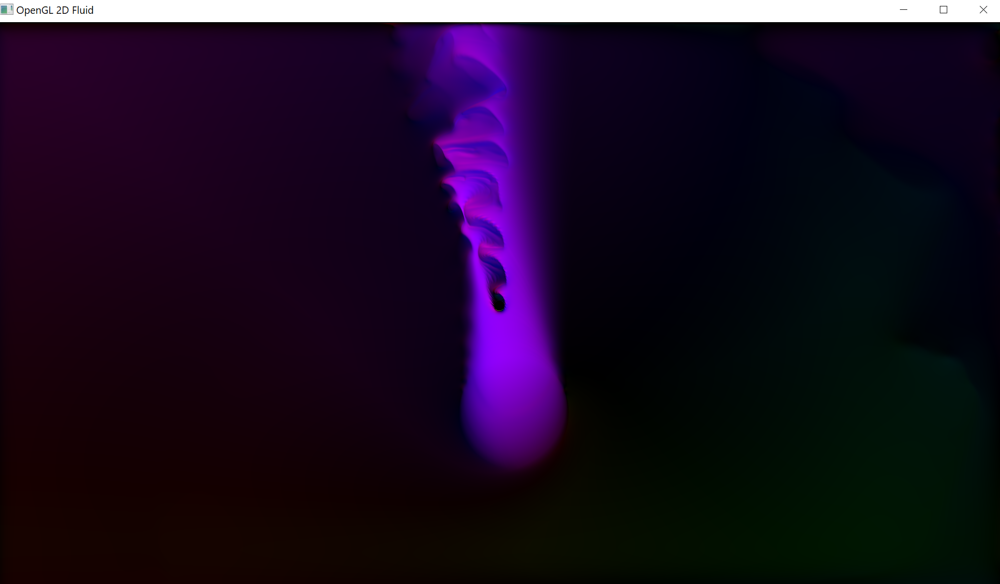

# FluidSim
The goal of this project is to achieve a non-compressible Eulerian Fluid simulation using the finite element method. 

Current state of the simulation using the VELOCITY display mode : 



## What is done 
- implementing simulation of Fluid for games on CPU
- making controls to interact with the simulation
- displaying simulation with 2 modes : VELOCITY MODE and DENSITY MODE
- Modifying bounds management to simplify it and to easily add_input objects and obstacles (with a mask array)
- Simplify project function on CPU and see if it works well (it doesn't work well)
- passing everything on GPU using openGL to have better performance (it's still have to be optimized)


## To do
- add a third dimension
- passing everything on GPU using Vulkan and compare the performance with the openGL simulation to see if Vulkan really worths a try
- make a vorticity confinement step to improve performance and accuracy
- make a version of the code without substeps but with a compite shader that can inverse a matrix (to have an exact step and to see if it is fast enough) 
- make an interface with ImGui to have better interactions with the simulation
- make a sound input 

## Future of the project
- learn how to transform the Fluid into plasma, and add magnets
- make a simulation of a rocket engine
- make a simulation of a nuclear fusion reactor

## Architecture

```plain text 
Fluid
│
├── 2D/Fluid2D
│   ├── CpuFluid2D
│   ├── GlFluid2D
│   └── VkFluid2D
│
└── 3D/Fluid3D
    ├── CpuFluid3D
    ├── GlFluid3D
    └── VkFluid3D
```

